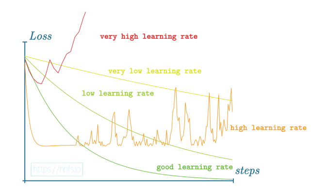

# Wiki personnel pour revenir facilement aux notions abordées.

## **
Définition d'un réseau de neurones
**

Un réseau de neurones est un type de modèle informatique inspiré de la façon dont fonctionne le cerveau humain. Il est composé de plusieurs couches de "neurones" connectés entre eux qui travaillent ensemble pour effectuer des tâches telles que la reconnaissance d'images ou de la génération de texte.

Chacun des neurones dans un réseau de neurones est relié à plusieurs autres neurones, et chacun de ces liens associé à un poids qui détermine la force de l'influence d'un neurone sur un autre.

Les réseaux de neurones peuvent être "entraînés" en utilisant des données d'entraînement et des algorithmes de rétropropagation pour ajuster les poids de manière à améliorer les performances du modèle.

## **
Fonction d'activation
**

Une fonction d'activation est une fonction mathématique utilisée dans les réseaux de neurones pour décider si un neurone doit être activé ou non. Elle prend en entrée la somme pondérée des entrées d'un neurone et produit une sortie qui peut être utilisée comme entrée pour les neurones suivants dans la réseau.

Il existe différentes fonctions d'activation comme la fonction sigmoïde, la fonction ReLU et la fonction tangente hyperbolique.

    
Fonction d'activation ReLU

Elle permet de ne garder que les valeurs positives en sortie des neurones. Elle améliore la convergence du réseau et évite le problème du gradient vanishing.

$$\large
f(x) = max(0, x) = \begin{cases}
0 & \text{si } x \leq 0 \\
x & \text{si } x > 0 \\
\end{cases}
$$

    
Fonction d'activation Sofmax

La fonction d'activation softmax est souvent utilisée dans les réseaux de neurones pour les tâches de classification multiclasse. Elle prends en entrée un vecteur de valeurs réelles et produit en sortie un vecteur de probabilités, c'est-à-dire une distribution de probabilité sur les classes possibles. Chaque élément de la sortie est compris entre 0 et 1 et la somme des éléments vaut 1.

On écrit sa fonction comme suit:
$f_i(x) = \frac{e^{x_i}}{\sum^{k}_{j = 1} e^{x_j}}$

On l'utilise généralement pour un problème de classification.

## **
Fonction de perte et rétropropagation
**

<!-- TODO: Faire une description -->

    
Fonction de perte Categorical cross-entropy

La fonction de perte categorical cross entropy est une fonction de coût couramment utilisée pour les tâches de classification multiclasse. Elle mesure la différence entre la distribution de probabilité prédite par le modèle et la distribution de probabilité réelle pour chaque classe.

On écrit sa fonction comme suit:

$L_i = -\sum_j y_{i,j} log(\hat{y}_{i,j})$

On l'utilise souvent en conjonction avec la fonction d'activation softmax.

    
Softmax et Categorical cross-entropy.

La fonction d'activation softmax et la fonction de perte categorical cross-entropy peut être simplifier et on peut les calculer plus vite. Voici les équations.

<!-- TODO: Expliqué comment on fait et pourquoi on le fait. -->

## **
Analyse des données
**

    
Comment interpréter les courbes de Loss ?

Une courbe de perte (loss) est un graphique qui représente l'évolution de la fonction de coût (ou perte) au cours des itérations d'entraînement d'un modèle d'apprentissage automatique. Il est utilisé pour visualiser la performance d'un modèle et pour déterminer si celui-ci est surajusté ou sous-ajusté.

Voici quelques interprétations courantes pour une courbe de perte :

* Si la courbe de perte décroit rapidement au début de l'entraînement, cela indique que le modèle est capable d'apprendre rapidement et que les paramètres sont bien choisis.
* Si la courbe de perte est plate après plusieurs itérations, cela indique que le modèle est sous-ajusté et que les paramètres sont mal choisis, il faut augmenter la complexité du modèle ou augmenter le nombre d'itération.
* Si la courbe de perte augmente au cours de l'entraînement, cela indique que le modèle est surajusté et que les paramètres sont mal choisis, il faut diminuer la complexité du modèle ou utiliser des techniques de régularisation pour éviter le surajustement.
* Si la courbe de perte est plate après plusieurs itérations avec une faible valeur cela indique que le modèle a convergé vers un minimum local de la fonction de coût et qu'il a atteint une performance satisfaisante. Il est alors possible de terminer l'entraînement. La courbe de perte peut avoir des fluctuations pour certaines méthodes d'optimisation comme SGD, cela est dû aux variations des données d'entraînement utilisées à chaque itération.

L'interprétation de la courbe de perte dépend de la fonction de coût utilisée pour entraîner le modèle, il est donc important de s'assurer que la fonction de coût est appropriée pour la tâche d'apprentissage. La courbe de perte n'est qu'une partie de l'évaluation de la performance d'un modèle, il est nécessaire d'utiliser d'autres métriques, comme la précision, pour évaluer complètement un modèle.

    
Overfitting

Mémoriser les données sans les comprendre. Le modèle prédit très bien les données qu'il a déjà vu mais généralise très mal pour les données inconnues.

Pour éviter cela, il vaut mieux avoir un jeu de test pour valider si le modèle.

S'il y a une différence de plus de 10% en accuracy c'est que le modèle a fait du sur-apprentissage.

Les causes peuvent être une learning rate trop grande, trop d'epochs ou le modèle est trop gros.

=> Modèle n'apprends pas : Essayer un modèle plus gros
=> Modèle apprends : Essayer un modèle plus petit

L'idéal est d'avoir une courbe de loss lors avec le jeu de test identique à la training loss même si cela veut dire une plus grande loss et une plus faible accurracy. Des performances similaires signifie une meilleure généralisation.

    
Validation data

Pour le créer deux options:

- Diviser le training dataset en training dataset et en validation dataset. (Si assez gros)
- Cross Validation: Diviser le training dataset en plusieurs parties et à chaque epoch choisir une partie différente comme validation dataset.

Lors d'une cross validation, on laisse le réseau s'entraîner plusieurs fois pour tester différents hyperparamètres.

    
Training dataset

Il est généralement nécessaire de réaliser du preprocessing. Les réseaux de neurones marchent mieux avec des valeurs comprises en 0 et 1 ou -1 et 1. Centré les valeurs en 0 permet d'éviter atténuer les weights biasind dans certaines directions. C'est mieux d'utiliser une range entre -1 et 1.

On utilise cette range car sinon avec des nombres trop grands, la valeurs de nos poids va devenir instable ou overflow.

POur des valeurs comprises entre 0 et 255, on divise tout le dataset et on obtient des valeurs entre 0 et 1.
Si on soustrait 127.5, puis on divise par 127.5, on obtient des valeurs entre -1 et 1.

On essaie de d'appliquer le même coef donc on prends le max du training dataset. Si on utilise des capteurs, il faut garder ce coef car sinon lors des prédictions, le modèle ne reconnaitra pas les valeurs sans être scalé.

On peut aussi utiliser de la data augmentation si le jeu de donnée est trop petit. Cela consiste à déformer les images pour en avoir de nouvelles tant que cela reste des cas possibles dans la réalitée.

Combien d'éléments par classe ? => entre 1000 et 10000 par classes.

## **
Descente de gradient
**

Une descente de gradient est un algorithme qui permet de trouver le minimun de n'importe quelle fonction convexe en convergeant progressivement vers elle. La descente de gradient est un algorithme d'optimisation utilisé pour minimiser une fonction de coût. Il est utilisé pour ajuster les paramètres d'un modèle de manière à minimiser l'erreur entre les prédictions du modèle et les valeurs réelles.

Le principe de base de la descente de gradient consiste à mettre à jour les paramètres en suivant la direction opposée au gradient de la fonction de coût par rapport aux paramètres. Le gradient est un vecteur qui indique la direction de la plus forte augmentation de la fonction de coût, donc en allant dans la direction opposée, on s'attend à ce que la fonction de coût diminue.

    
 Comment fonctionne le decay et le momentum 

Le momentum est une technique utilisée pour améliorer la convergence de l'algorithme de descente de gradient. Il est basé sur l'idée que si un modèle se déplace dans une direction particulière, il est probable qu'il continue à se déplacer dans cette direction. Pour utiliser le momentum, on utilise une moyenne pondérée des gradients passés pour mettre à jour les paramètres. Cela permet de lisser les fluctuations dans les gradients, ce qui peut aider à éviter de se retrouver bloqué dans des minima locaux et accélérer la convergence vers un minimum global.

Le decay, aussi appelé régularisation par pénalité de décroissance, est une technique utilisée pour réduire l'overfitting en limitant la taille des paramètres d'un modèle. Il est utilisé pour "pénaliser" les paramètres qui ont des valeurs trop élevées. Il est généralement implémenté en ajoutant une termes à la fonction de coût qui est proportionnel à la valeur des paramètres ou de leur carrés. Cela permet de réduire la complexité du modèle et d'améliorer sa performance sur des données de test.

En résumé, le momentum permet de stabiliser et d'accélérer la descente de gradient tandis que la régularisation par decay permet de limiter la complexité du modèle pour éviter l'overfitting.

    
 Optimiseur SGD 

L'optimiseur SGD (Stochastic Gradient Descent) est une variante de la descente de gradient qui utilise un échantillon aléatoire à chaque étape d'optimisation pour accélérer les calculs. Il est souvent utilisé pour entraîner des modèles de grande taille qui ne peuvent pas être entièrement chargés en mémoire.

L'algorithme de SGD est défini comme suit :
* Initialiser les paramètres w avec des valeurs aléatoires
* Pour chaque itération i:
    * Choisir un échantillon aléatoire (x, y) de la base de données d'entraînement
    * Calculer la perte par rapport à l'échantillon choisi : $ L = \frac{1}{2}(f(x;w)-y)^2 $
    * Calculer les gradients par rapport aux paramètres w : $\frac{\partial L}{\partial w}$
    * Mettre à jour les paramètres en utilisant la formule suivante : $w = w - \eta \frac{\partial L}{\partial w}$

où
* $w$ est un vecteur de paramètres
* $f(x;w)$ est la sortie du modèle pour une entrée $x$
* $y$ est la sortie attendue pour l'entrée $x$
* $η$ est la vitesse d'apprentissage, c'est un paramètre qui contrôle la vitesse à laquelle les paramètres sont mis à jour.

Il est important de noter que la vitesse d'apprentissage $η$ doit être choisie avec soin pour éviter la divergence ou une convergence trop lente. Il est également souvent nécessaire de diminuer la vitesse d'apprentissage au fil du temps pour permettre une convergence

    
 Optimiseur Adagrad 

Adagrad (Adaptative Gradient Algorithm) est un optimiseur qui utilise une méthode d'adaptation automatique de la vitesse d'apprentissage pour chaque paramètre. Il est souvent utilisé pour entraîner des modèles avec un grand nombre de paramètres ou des données de grande taille.

L'algorithme d'Adagrad est défini comme suit :

* Initialiser les paramètres $w$ avec des valeurs aléatoires
* Initialiser un vecteur de cache $G$ avec des valeurs égales à 0
* Pour chaque itération i:
    * Choisir un échantillon aléatoire (x, y) de la base de données d'entraînement
    * Calculer les gradients par rapport aux paramètres w : $\frac{\partial L}{\partial w}$
    * Mettre à jour le vecteur de cache G : $G = G + \left(\frac{\partial L}{\partial w}\right)^2$
    * Mettre à jour les paramètres w : $w = w - \frac{\eta}{\sqrt{G+\epsilon}}\frac{\partial L}{\partial w}$

où

* $w$ est un vecteur de paramètres
* $G$ est le vecteur de cache
* $η$ est la vitesse d'apprentissage initiale, c'est un paramètre qui contrôle la vitesse à laquelle les paramètres sont mis à jour.
* $\epsilon$ est un petit nombre pour éviter la division par 0

Cependant, il a tendance à diminuer la vitesse d'apprentissage trop rapidement pour les paramètres qui ont des gradients plus fréquents, ce qui peut entraîner une convergence trop lente ou une divergence dans certaines situations. Il est donc souvent nécessaire d'utiliser des techniques de régularisation pour éviter ces problèmes.

En résumé, Adagrad est un optimiseur qui utilise une méthode d'adaptation automatique de la vitesse d'apprentissage pour chaque paramètre, mais il peut avoir des problèmes de convergence pour certains cas.

    
Optimiseur RMSprop

RMSprop (Root Mean Square Propagation) est un optimiseur qui est similaire à Adagrad. Il utilise également une méthode d'adaptation automatique de la vitesse d'apprentissage pour chaque paramètre, mais il utilise une moyenne glissante pour le vecteur de cache. Cela permet de réguler les variations de la vitesse d'apprentissage pour éviter les oscillations et améliorer la stabilité de l'optimisation.

L'algorithme de RMSprop est défini comme suit :
* Initialiser les paramètres w avec des valeurs aléatoires
* Initialiser un vecteur de cache G avec des valeurs égales à 0
* Pour chaque itération i:
    * Choisir un échantillon aléatoire (x, y) de la base de données d'entraînement
    * Calculer les gradients par rapport aux paramètres w : $\frac{\partial L}{\partial w}$
    * Mettre à jour le vecteur de cache G : $G = \beta G + (1-\beta)\left(\frac{\partial L}{\partial w}\right)^2$
    * Mettre à jour les paramètres w : $w = w - \frac{\eta}{\sqrt{G+\epsilon}}\frac{\partial L}{\partial w}$

où
* w est un vecteur de paramètres
* G est le vecteur de cache
* η est la vitesse d'apprentissage initiale, c'est un paramètre qui contrôle la vitesse à laquelle les paramètres sont mis à jour.
* $\epsilon$ est un petit nombre pour éviter la division par 0
* $\beta$ est un coefficient de moyennage glissant qui permet de réguler les variations de la vitesse d'apprentissage.

Il est important de noter que RMSprop utilise un terme de moyennage glissant pour le vecteur de cache, cela permet de réguler les variations de la vitesse d'apprentissage et d'éviter les oscillations, ce qui permet d'accélérer la convergence vers un minimum global. Il est souvent utilisé pour entraîner des modèles avec un grand nombre de paramètres ou des données de grande taille.

    
Optimiseur Adam 

Adam (Adaptive Moment Estimation) est un optimiseur qui combine les avantages de RMSprop et de la méthode d'estimation des moments (momentum method). Il utilise également une méthode d'adaptation automatique de la vitesse d'apprentissage pour chaque paramètre, mais il utilise également une méthode d'estimation des moments pour améliorer la stabilité de l'optimisation.

L'algorithme d'Adam est défini comme suit :

* Initialiser les paramètres w avec des valeurs aléatoires
* Initialiser les vecteurs de cache m et v avec des valeurs égales à 0
* Pour chaque itération i:
    * Choisir un échantillon aléatoire (x, y) de la base de données d'entraînement
    * Calculer les gradients par rapport aux paramètres w : $\frac{\partial L}{\partial w}$
    * Mettre à jour les vecteurs de cache m et v : $m = \beta_1 m + (1-\beta_1)\frac{\partial L}{\partial w}$ et $v = \beta_2 v + (1-\beta_2)\left(\frac{\partial L}{\partial w}\right)^2$
    * Appliquer la correction de bias pour les vecteurs de cache : $ \hat{m} = \frac{m}{1-\beta_1^i}$ et $\hat{v} = \frac{v}{1-\beta_2^i}$
    * Mettre à jour les paramètres w : $w = w - \frac{\eta}{\sqrt{\hat{v}}+\epsilon}\hat{m}$

où
* $w$ est un vecteur de paramètres
* $m$ est le vecteur de cache pour les moments premiers
* $v$ est le vecteur de cache pour les moments secondes
* $η$ est la vitesse d'apprentissage initiale, c'est un paramètre qui contrôle la vitesse à laquelle les paramètres sont mis à jour.
* $\epsilon$ est un petit nombre pour éviter la division par zéro
* $\beta_1$ et $\beta_2$ sont des coefficients de moyennage glissant pour les moments premiers et secondes respectivement, qui permettent de réguler les variations de la vitesse d'apprentissage.

Adam utilise les vecteurs de cache $m$ et $v$ pour stocker les moments premiers et secondes des gradients pour chaque paramètre, respectivement. Il utilise également les termes de correction de biais pour éviter les biais dus aux termes de moyennage glissant pour les moments premiers et secondes. Cela permet à Adam de combiner les avantages de RMSprop et de la méthode d'estimation des moments pour améliorer la stabilité de l'optimisation.

En résumé, Adam est un optimiseur qui utilise une méthode d'adaptation automatique de la vitesse d'apprentissage pour chaque paramètre, une moyenne glissante pour les moments premiers et secondes des gradients, et une correction de bias pour éviter les biais dus aux termes de moyennage glissant. Il est souvent utilisé pour entraîner des modèles complexes avec un grand nombre de paramètres ou des données de grande taille. Il est important de noter que Adam est un optimiseur très populaire et qu'il est souvent utilisé par défaut dans les bibliothèques de deep learning car il est généralement efficace pour une grande variété de tâches d'apprentissage automatique.

    
Valeur par défaut pour les optimiseurs

* Learning rate (η): valeur de 0,01 à 0,1 pour les optimiseurs tels que SGD, Adagrad, RMSprop et Adam.
* Moyennage glissant (beta1 et beta2): valeurs de 0,9 pour beta1 et 0,999 pour beta2 pour Adam.
* Epsilon : valeur de 10^-8 pour Adam et RMSprop.

## **L1 & L2 regularization**

L1 et L2 regularization sont des valeurs ajoutées à la loss pour pénaliser le modèle qui a de trop grandes valeurs. Souvent si les weights sont plus grand c'est qu'ils essaient de mémoriser la donnée.

L1 est une pénalisation linéaire, et proportionnel aux pramètres.

L2 est non linaire et pénalise plus les gros poids que les petits.

On utilise souvent L1 avec L2 sinon on ne l'utilise pas car il a tendance à pénaliser les petits poids.

On ajoute une constante pour controler l'impact de la pénalisation sur la loss.

### L1 regularization for forward pass:

$$\large
    \begin{align} 
        L_{1_w} = \lambda \sum |w_m| && L_{1_b} = \lambda \sum |b_m|
    \end{align}
$$

### L2 regularization forward pass

$$\large
    \begin{align} 
        L_{2_w} = \lambda \sum w_m² && L_{2_b} = \lambda \sum b_m²
    \end{align}
$$

La nouvelle notation de la loss va devenir: 
$Loss = DataLoss + L_{1_w} + L_{1_b} + L_{2_w} + L_{2_b}$

### L2 backward pass

$$
    \frac{\partial L_{w_2}}{\partial w} = 2\lambda w_m
$$

### L1 backward pass

$$
    \frac{\partial L_{w_1}}{\partial w} = \lambda w_m 
    \begin{cases}
        1 & \text{si } w_m > 0 \\
        -1 & \text{si } w_m < 0 \\
\end{cases}
$$

## **Dropout**

Ce type de couche désactive certains neurones, tandis que les autres passent sans être modifiés.
Une couche de dropout permet aux neurones de ne pas être trop interdépendant. Cela prévient aussi de la co-adoption
Le dropout peut également aider avec le bruit et d'autres perturbations dans les données d'entraînement, car plus de neurones travaillant ensemble signifient que le modèle peut apprendre des fonctions plus complexes

On va désactivé des neurones selon une loi de bernouilli.

### Forward pass

$$
P(r_i = 0) = q = 1 - p = 1 - P(r_i = 1)
$$

### Backward pass

$$
    Dr_i = \begin{cases}
            \frac{z_i}{1-q} & r_i = 1 \\
            0 & r_i = 0 \\
        \end{cases} 
        \rightarrow
        \frac{\partial}{\partial z_i} Dr_i = \begin{cases}
            \frac{1}{1-q} & r_i = 1 \\
            0 & r_i = 0 \\
        \end{cases} =  \frac{r_i}{1-q}
$$